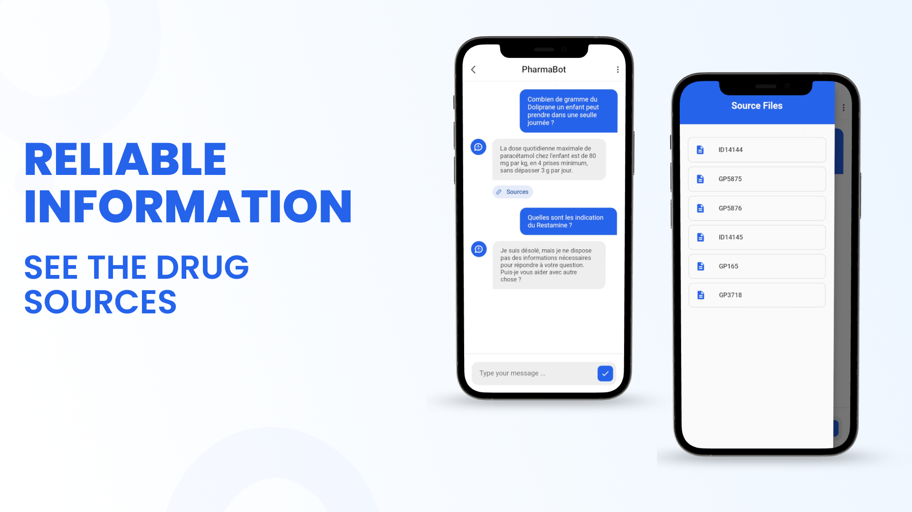

💊 Pharmabot – AI-Powered Pharmaceutical Assistant
Pharmabot is a modern, cross-platform mobile application built with Flutter that serves as a user-friendly interface for a sophisticated pharmaceutical AI.

The app connects to a powerful Retrieval-Augmented Generation (RAG) backend, providing pharmacists and medical professionals with instant, accurate, and verifiable answers to complex drug-related queries. It's designed to be fast, reliable, and trustworthy.

✨ Core Features
🤖 Real-time AI Interaction – Communicate seamlessly with the advanced AI core using a responsive chat interface powered by WebSockets.

🔗 Verifiable Source Linking – Every AI-generated answer includes a direct link to the source package insert, which can be viewed instantly within the app using an integrated WebView.

🧠 Conversational Memory – The chatbot remembers the context of the conversation for more natural and relevant follow-up questions.

🌙 Sleek & Professional UI – A clean, intuitive interface designed for professional environments, complete with both light and dark themes.

🔒 Secure & Efficient Connection – Built on a robust FastAPI backend to ensure the communication between the app and the AI model is both fast and secure.

📱 Cross-Platform by Design – A single codebase for both Android and iOS, thanks to Flutter.

🏗️ System Architecture
The Pharmabot system is built on a decoupled, three-tier architecture to ensure scalability and maintainability.

Flutter Mobile App (Frontend) – The user-facing application that handles all UI/UX components and user interactions.

FastAPI Server (API Gateway) – A Python-based backend that serves as the bridge, managing WebSocket connections and routing requests to the AI core.

RAG AI Core (The Brain) – The powerful Python backend where the Knowledge Graph, Large Language Models, and retrieval logic reside to process queries and generate answers.

📸 App Screenshots
Here are some previews of the Pharmabot mobile application in action.

(You can replace these placeholders with your actual screenshots.)

🛠️ Tech Stack & Tools
Frontend (Mobile App)
Framework: Flutter (Dart)

Architecture: Clean Architecture / MVVM (or your chosen architecture)

State Management: Provider / Bloc

Real-time Communication: web_socket_channel

Embedded Content: webview_flutter

UI Packages: animate_do, etc.

Backend (API Layer)
Framework: FastAPI (Python)

Communication Protocol: WebSockets

🎯 Project Goal
In the high-stakes pharmaceutical field, access to fast and reliable information is critical. Standard AI models risk "hallucinations," providing confident but incorrect answers.

Pharmabot was built to solve this. By grounding a powerful LLM in a verifiable knowledge base, this project provides a tool that pharmacists can trust. The mobile app makes this technology accessible, practical, and easy to integrate into a professional's daily workflow.

📬 Contact Us
This project was a collaborative effort. Feel free to reach out to us!

[Elmehdi Elouissi]: [https://github.com/dadixcod] | [https://linkedin/in/dadixcod]

[Younes Chalabi]: [https://github.com/youneschalabiii] | [https://www.linkedin.com/in/younes-chalabi-a4900b30b/]

👨‍💻 Developed by [Mehdi] & [Younes] with ❤️